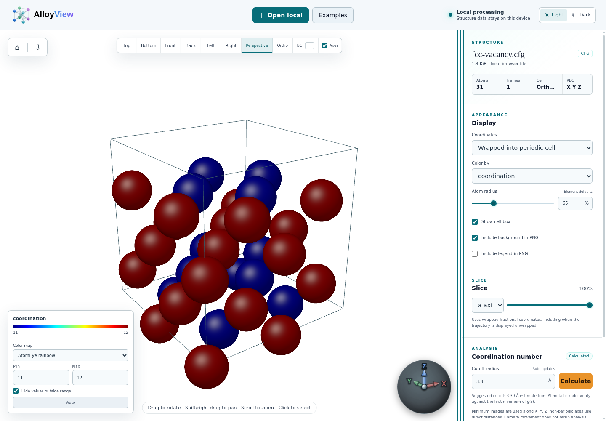

<h1 align="center">
  <picture>
    <source media="(prefers-color-scheme: dark)" srcset="src/asserts/logo/AlloyView_logo_light.svg">
    
  </picture>
</h1>

<p align="center">
  <a href="https://yazhuoliu.com/AlloyView/">Use online</a> ·
  <a href="https://yazhuoliu.com/AlloyView/docs/">Documentation</a> ·
  <a href="#quick-start">Quick start</a> ·
  <a href="docs/USER_GUIDE.md">User &amp; development guide</a> ·
  <a href="docs/FORMATS.md">Supported formats</a>
</p>

AlloyView is a browser-based viewer for atomistic structures and trajectories
in metals and alloys. Open AtomEye CFG, LAMMPS dumps and data files, XYZ, PDB or VASP POSCAR, inspect
atoms, calculate structural properties, and export figures. Files are parsed and
analyzed on your device; structure data is never uploaded by the application.

## Viewer

<picture>
  <source media="(prefers-color-scheme: dark)" srcset="docs/images/alloyview-dark.png">
  
</picture>

An FCC vacancy structure, colored by coordination number. The 3D view
is on the left; structure information, display settings, slicing and analysis
are on the right. Switch between **Light** and **Dark** in the top bar.

## Features

- AtomEye CFG, LAMMPS text dumps and data files, plain/extended XYZ, PDB and
  VASP POSCAR/CONTCAR, including
  triclinic cells, numeric scalar/vector properties and periodic boundary flags.
- Individual files, multi-frame trajectories and numbered structure sequences,
  with a timeline and continuous playback.
- WebGL 2 sphere rendering, element-aware atom radii, six standard views,
  perspective/orthographic projection, cell outlines and Cartesian axes.
- Wrapped and unwrapped trajectory views, atom-ID search/centering, and
  distance, bond-angle and dihedral measurements with optional periodic images.
- Fractional periodic display origins along triclinic cell vectors, with
  selected-atom centering and synchronized atoms, bonds, vectors and DXA lines.
- A folded **Adjust view** panel beside download provides precise camera
  position/direction, roll, projection and field of view, plus a draggable
  orientation globe and sliders that follow viewport gestures.
- Element and individual-atom color, radius and visibility overrides.
- Named atom selection groups created by clicking, box selection or ID entry,
  with editable membership, color and visibility that follow stable IDs across
  frames and survive JSON configuration replay.
- Periodic bond graphs with element-pair cutoff overrides and adjustable bond
  radius. The same cutoffs drive bond-length and bond-angle distributions and
  local Steinhardt Q4/Q6 orientational order, using parallel CPU Workers or WebGPU.
  Independent displacement analysis provides physical Cartesian components
  and magnitude for coloring against a selected reference frame.
- Up to 16 named vector fields draw displacement, imported force/velocity and
  custom XYZ data simultaneously, with independent colors, visibility and sizes,
  per-component scales, Tail/Head/Center anchors, and 3D or camera-facing/fixed-plane
  2D glyphs. Arrows remain
  visible when atoms are hidden; display scales leave physical properties unchanged.
- Up to 16 independent clipping planes with arbitrary Cartesian normals,
  editable names and positions, draggable plane/normal controls, and two- or
  three-atom plane construction using the clicked periodic image.
- External numeric CSV/AUX properties mapped by stable atom ID or row order,
  parsed and expanded in a persistent Worker, with rename/removal and access
  from colors, atom details and vector fields.
- Replication along independent periodic cell vectors, including triclinic
  tilts. Display copies reuse analysis; optional **Replicate atoms for analysis**
  creates real atoms in an enlarged cell and recalculates enabled analyses.
- Periodic cutoff-based coordination analysis in browser Workers, with an
  editable cutoff suggestion for recognized metallic elements.
- Adaptive/fixed-cutoff CNA for FCC, HCP, BCC and icosahedral environments,
  crystal colors and per-class visibility checkboxes with live counts.
- Real polyhedral template matching (PTM) in Wasm Workers, with eight crystal
  templates, an adjustable RMSD threshold and the same crystal visibility controls.
- Atomic elastic strain relative to an ideal lattice, with editable element-based
  or geometry-estimated lattice constants, shear/hydrostatic strain, volume change
  and tensor components. Missing numeric-type references can be estimated with PTM.
- Reference-frame least-squares strain using stable atom IDs, plus AtomEye-style
  single-frame local geometric shear with optional mean-tensor subtraction.
- Coordination histograms and total/element-pair radial distribution functions
  with CSV export. Normalized RDF requires three periodic axes and a cutoff
  within half the shortest cell face height.
- Voronoi tessellation in Visualization tools, using dynamically scheduled
  CPU/Wasm Workers or WebGPU for periodic or finite-cell geometry. Results include atomic
  volume, surface area, coordination, full Voronoi indices and population
  distributions, with optional input-type selection, neighbor-face area filters,
  folded interactive histograms and quantity-color shortcuts. Cell display
  optionally draws the selected cell or all analyzed cells; both default off.
- CSV export for the complete statistical summary, scalar statistics,
  categorical populations, coordination/RDF and bond distributions, Q4/Q6,
  Voronoi cells/faces, DXA families/lines and per-atom properties. A persistent
  export Worker formats completed results without rerunning analyses.
- AtomEye normalized central symmetry with automatic local FCC/HCP/BCC
  settings for mixed structures, or manual 8/12 neighbors. All analyses share
  a bounded scheduler and retain per-frame results. CPU Workers
  and PTM kernels are reused, with preparation stages and PTM atom progress.
- **Enable GPU acceleration**, on by default beside the theme controls,
  supports coordination, adaptive/fixed-cutoff CNA, manual/Auto central symmetry,
  displacement, reference-frame strain, RDF, local geometric shear, bonds,
  bond-length/angle distributions and local Q4/Q6,
  and PTM neighbor preparation with WebGPU.
  Fresh ideal lattice strain uses GPU neighbor preparation, CPU Wasm fitting,
  then GPU element-reference conversion and tensors, reusing cached fits and
  uploads. DXA performs complete CPU/Wasm extraction, automatically using one
  shared heap and a pthread pool on isolated hosts. Nonisolated hosts can
  offload local crystal identification and tetrahedron classification to the
  existing CPU Worker pool while one coordinator retains the global network.
  Automatic private stages use at most four Workers, subject to memory limits.
  Small jobs and unavailable Workers use native CPU stages.
  Its backend is independent of the GPU preference. Other analyses keep
  their CPU implementation; unavailable GPU support falls back to CPU.
  Completed results remain available when the preference changes.
- Per-analysis Cancel controls stop computation and reset results and frame
  caches while keeping input settings and other analyses.
- A legend **Color by** selector for switching between available properties and
  completed analysis quantities, synchronized with the Display controls.
  Atom-type colors and ten scalar color maps, with an Auto range toggle,
  editable limits that stay fixed across frames, and optional filtering of
  out-of-range atoms.
- Independent crystal visibility from CNA, PTM, Auto central symmetry, ideal
  lattice strain or DXA, including when coloring by a scalar quantity. DXA
  lines use continuous tube surfaces while retaining the scientific network.
- PNG export with independent background, legend and XYZ-arrow controls,
  JPG export, visible atom-ID lists, six-view contact sheets and cancellable
  trajectory image sequences packaged as ZIP files.
  Exported arrows are optional and off by default. Transparent
  exports keep the legend labels and color keys without a filled legend panel.
- Light and dark themes with matching project logos and a saved preference.
- A resizable controls panel with saved width, plus live display and legend
  edits and automatic coordination updates when the cutoff changes.
- Side-by-side **Visualization tools** and **Modification tools** tabs preserve
  enabled analyses and remember their settings panels. Modification tools
  contain replication and external properties, with a registry for future atom
  editors. Phones keep the viewport above independently scrolling tools and
  collapsed camera/legend controls.
- An optional movable, resizable second view reuses the current frame and
  analysis results, with its own camera, PNG export and **Apply to main**
  control. Configuration saves its camera and portable viewport-relative layout.
- JSON configuration export/import directly below Structure saves source file metadata, processing
  settings, camera and theme, then restores the view and recomputes enabled
  analyses after the matching local files are opened.
- Bundled CoCrFeMnNi FCC with a screw dislocation, BCC Fe with a spherical
  carbon inclusion, 40-image NEB, and 129,904-atom Ni grain-boundary examples.
  The HEA and Fe–C structures are unrelaxed demonstration models. In the
  Fe–C example, add a slice with normal Z and position 34.392 Å to reveal
  the embedded carbon particle.
- Contextual **?** help opens individual feature documentation; a static documentation
  website includes controls, algorithms, implementation links and deployment guides.

## Quick start

Open the [online viewer](https://yazhuoliu.com/AlloyView/) in a browser with
WebGL 2 support. No installation or account is needed.

1. **Open a structure.** Click **Open local → Choose files…** for one or more
   CFG/LAMMPS/XYZ/PDB files. Use **Choose folder…** to browse a folder and detect
   numbered sequences automatically. Drop a file anywhere on the page to open
   it individually; dropping several files lets you choose one. Or click
   **Examples** and choose a bundled source. The **×** beside the filename closes
   the current structure and returns to the homepage.
2. **Navigate.** Drag to rotate, Shift/right-drag to pan, and scroll to zoom.
   On touchscreens, drag with one finger to rotate, pinch with two fingers to
   zoom, and move both fingers together to pan. Click or tap an atom to inspect
   its ID, type, coordinates and scalar properties.
   Use the standard views, **Perspective** or **Ortho** to set the camera.
   Drag the divider beside the right panel to adjust its width; double-click
   the divider to restore the default.
3. **Adjust the view.** Choose colors and atom size in **Display**, change the
   viewport color with **BG**, or hide the cell and axes. Trajectories expose
   wrapped/unwrapped coordinates and frame controls below the viewport.
   Under **Tools**, use **Visualization tools** for display and analysis and
   **Modification tools** for Replicate and External properties. Categories
   remember their last settings panel and keep enabled analyses running.
   Select **Modification tools → Replicate** to set total copies along periodic
   **a/b/c** directions and click **Apply**. **Replicate atoms for analysis** is off by default;
   enable it to analyze physical copies in an enlarged cell, using more memory
   and computation. **Selections** creates named groups by clicking, dragging
   a box or entering atom IDs. Edit each group's color and visibility, and use
   Add/Remove/Replace to update members. Closing this tool keeps the groups.
   Under **Slice**, click **Add slice** and set a Cartesian
   normal, position in Å and retained side. Drag the arrowhead to rotate the
   plane on a guide sphere, or its shaft to move it; the fields follow dragging.
   Multiple enabled slices keep the intersection of their retained sides.
   Select a tool button to open its settings; switch tools
   to keep analyses running, or close an analysis to cancel it and reset results.
4. **Analyze.** Check the suggested cutoff under **Coordination number** and
   click **Calculate**. **Cutoff preset** offers Custom and 35 common metals,
   automatically selecting a recognized element from the file. Editing the
   radius keeps a custom value. Use **Color by** in the viewport legend to switch
   between available quantities without recalculating. The scalar legend also
   lets you choose a color map and
   adjust the visible range. Highlighted **Auto** follows the current frame;
   editing either limit turns Auto off and preserves that property's limits
   across frames. Click **Auto** again to fit the current frame and resume
   automatic limits. Editing the cutoff automatically recalculates
   after a short typing pause. Display and legend edits apply immediately.
   The cutoff is a starting estimate; choose it for
   your structure's neighbor shells.
   Use **Common neighbor analysis** or **Polyhedral template matching** for
   crystal identification, then the legend checkboxes to show/hide each class.
   **Crystal visibility** also filters those classes while **Color by** shows
   CSP, strain or another quantity, using existing identification results.
   **Central symmetry → Auto** identifies FCC/HCP/BCC locally and selects 12
   neighbors for FCC/HCP or 8 for BCC, including mixed structures. Its summary
   shows the recognized phases; ideal HCP has a finite symmetry value.
   Under **Ideal lattice reference**, check the element, crystal phase and
   lattice constants before calculating atomic elastic strain.
   **Estimate from structure** fills missing values from crystal geometry;
   first-time strain calculation also fills missing references automatically.
   Existing values stay fixed, and estimates describe the current bulk lattice.
   **Bonds** adds neighbor connections with optional element-pair cutoffs.
   Its folded statistics section calculates bond-length/angle distributions
   and local Q4/Q6 using those same cutoffs. **Voronoi** measures atomic volumes,
   surface areas and neighbor-face topology with periodic or finite-cell bounds.
   Its type checkboxes choose the input sites for the tessellation. Optional
   selected-cell or all-cell display adds polygonal geometry independently of
   the analysis; all-cell display uses additional memory.
   **Displacement** calculates Cartesian components and magnitude against a
   reference frame for atom coloring, independently of arrows.
   **Vector arrows** displays existing displacement, imported force/velocity,
   other complete vector families, or custom Cartesian components.
   **Frame strain** compares against a chosen trajectory frame;
   **Local shear** measures the current neighbor geometry without a reference.
   **Statistics** shows coordination distributions and calculates total or
   element-pair RDF curves on fully periodic cells. Its CSV section exports
   current-frame summaries, every available classifier and scalar property,
   and per-atom values; Bonds, Voronoi and DXA also offer specific CSV tables.
   **Enable GPU acceleration** in the top bar prefers WebGPU for coordination,
   adaptive/fixed CNA, manual/Auto central symmetry, displacement,
   reference-frame strain, RDF, local shear, bonds, bond statistics and ideal-strain
   neighbor/reference/tensor stages on the next calculation.
   DXA always uses CPU Wasm, with shared-memory threads when supported or
   private local-stage Workers on nonisolated hosts.
   PTM correspondence fitting still uses CPU Wasm. The switch starts on; CPU
   fallback keeps analyses available on browsers without suitable GPU support.
   See [performance](docs/features/performance.md) for backend choices and
   timing considerations.
5. **Export.** Choose **Include background in PNG** and **Include legend in
   PNG** independently, then click the download arrow in the viewport toolbar.
   Uncheck the background option for transparency, including around the legend.
   **Include XYZ arrows in PNG** adds the current Cartesian orientation even
   when the screen's axes are hidden; it is unchecked by default. PNGs show
   clipped atoms and omit slice editing overlays. Directly below **Structure**,
   **Export JSON** saves the current processing and view. **Import JSON**
   restores settings immediately for a matching open source; otherwise use
   **Open local** to select the saved source files with matching names and sizes.
   Atom data and calculated results stay in the source/session and are not
   embedded in the JSON.
   **Display → Export images and atom IDs** also offers JPG, six-view PNG,
   visible atom-ID lists and a ZIP of selected trajectory-frame images.

A single file picker cannot discover unselected sibling files. Select all
frames together or choose their folder to open a sequence.

## Run locally

Development requires Node.js 20 or newer. The viewer has no npm dependencies.

```bash
npm run dev
```

Open <http://localhost:5173>. To build and preview the static site:

```bash
npm run build
npm run preview
```

Open <http://localhost:4173>. The deployable site is in `dist/`.
Documentation is available at `/docs/` in development and preview; the build
renders its Markdown sources into static HTML pages in `dist/docs/`.

The compiled PTM, CPU DXA and Voronoi kernels are included in the repository. Normal
development and CI need no compiler. To rebuild their C++ integration, install
Emscripten and run `npm run build:ptm`, `npm run build:dxa` or
`npm run build:voronoi`; see
[Structure analysis](docs/STRUCTURE_ANALYSIS.md) and
[Dislocation analysis](docs/features/dislocations.md), or
[Voronoi analysis](docs/features/voronoi.md).

## Tests and deployment

```bash
npm test
npm run build
npm run test:browser
npm run test:browser:advanced-tools
```

The browser regression requires Node.js 24 and Chrome/Chromium; set
`CHROME_PATH` if needed. It serves the production build at `/AlloyView/`
without isolation headers, loads local files and all examples, checks themes
and trajectory frames, exercises CNA/CSP/PTM/strain and crystal visibility
filters, and decodes PNG exports to verify transparency and optional axes.
The advanced tools regression exercises real pointer/touch controls, periodic
copies, external-file mapping and replay, multiple vector fields, precise camera
edits and PNG exclusion of the camera panel.

The included GitHub Actions workflow tests, builds and deploys on pushes to
`main`. Set **Settings → Pages → Source → GitHub Actions** in the repository.
Each build versions the entire script/Worker/asset tree to prevent cached
modules from mixing file-loading protocols after deployment. See the
[deployment guide](docs/DEPLOYMENT.md).

## Documentation

| Topic | Reference |
| --- | --- |
| Detailed capabilities, local setup and current limits | [User & development guide](docs/USER_GUIDE.md) |
| CFG, LAMMPS, XYZ, PDB and POSCAR conventions | [Supported formats](docs/FORMATS.md) |
| Static hosting and GitHub Pages | [Deployment](docs/DEPLOYMENT.md) |
| Executed tests and benchmark results | [Validation record](docs/VALIDATION.md) |
| AtomEye design references and source provenance | [AtomEye review](docs/ATOMEYE_REVIEW.md) |
| CNA, PTM, ideal-lattice strain, central symmetry and parallel execution | [Structure analysis](docs/STRUCTURE_ANALYSIS.md) |

WebGL 2 is required. Compressed/binary dumps, LAMMPS input scripts, general
triclinic `abc origin` boxes, XDATCAR and NetCDF are not supported. LAMMPS data
files and VASP POSCAR/CONTCAR open as single structures.
Coordination uses one global cutoff; bond graphs have separate element-pair
overrides. Reference-frame strain requires explicit stable atom IDs.
Voronoi has CPU/Wasm and GPU paths, with exact CPU recovery when GPU geometry
exceeds numerical or resource limits. Q4/Q6 describe bond orientation rather than
chemical bond multiplicity.
Million-atom interactive performance has
not been verified; see the guide for memory and trajectory limitations.

## Contributing and support

Report bugs or request features through
[GitHub Issues](https://github.com/Yazhuo-Liu/AlloyView/issues). For loading
problems, include the browser version, file format and a small reproducible
sample when possible. Contributions are welcome as pull requests.

## License

AlloyView is distributed under the [MIT License](LICENSE). AtomEye informed
format conventions and neighbor-search design; no AtomEye C source or asset
is copied into this repository. The vendored PTM library is MIT licensed and
its embedded Voro++ code is BSD licensed; [third-party notices](licenses/)
ship with the static build. Voro++ also supplies the per-atom Voronoi clipping
kernel. See the [provenance review](docs/ATOMEYE_REVIEW.md).
